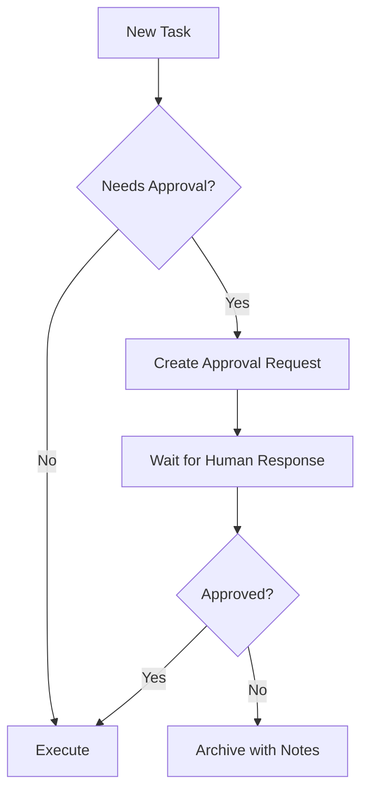

# Company Handbook

**Organization:** [Your Company Name]
**Version:** 1.0
**Last Updated:** 2026-01-24
**Managed By:** AI Employee

---

## Table of Contents

1. [[#Company Overview]]
2. [[#Mission & Values]]
3. [[#Organizational Structure]]
4. [[#Policies & Procedures]]
5. [[#AI Employee Guidelines]]
6. [[#Client Management]]
7. [[#Document Standards]]

---

## Company Overview

### About Us
[Brief description of the company, its history, and primary services]

### Contact Information
- **Primary Contact:** [Name]
- **Email:** [email]
- **Phone:** [phone]
- **Address:** [address]

---

## Mission & Values

### Mission Statement
[Your company's mission statement]

### Core Values
1. **Value 1:** [Description]
2. **Value 2:** [Description]
3. **Value 3:** [Description]
4. **Value 4:** [Description]

---

## Organizational Structure

### Leadership
| Role | Name | Contact |
|------|------|---------|
| CEO | | |
| Operations | | |
| Finance | | |

### Departments
- [ ] Department 1
- [ ] Department 2
- [ ] Department 3

### AI Employee Role
The AI Employee operates as a Business Manager Agent responsible for:
- Task intake and processing
- Planning and documentation
- Execution tracking
- Reporting and auditing

---

## Policies & Procedures

### Task Management Policy

#### Priority Levels
| Priority | Response Time | Criteria |
|----------|---------------|----------|
| High | Immediate | Critical business impact |
| Medium | Same day | Important but not urgent |
| Low | Within week | General tasks |

#### Approval Requirements
- **Auto-Approved:** Routine tasks, documentation
- **Human Approval Required:**
  - Financial decisions
  - Client communications
  - External commitments
  - Policy changes

### Documentation Standards
- All tasks must be documented
- Use markdown format
- Include timestamps
- Link related files

### Communication Protocol
- Internal updates via Dashboard
- Approval requests via `/needs_action` folder
- Client documentation in `/clients` folder

---

## AI Employee Guidelines

### Operating Principles
1. **Transparency:** All actions are logged and auditable
2. **Accuracy:** Verify before acting
3. **Boundaries:** Request approval for uncertain actions
4. **Organization:** Maintain clean folder structure

### File Structure
```
/AI_Employee_Vault
├── /inbox          # New incoming tasks
├── /needs_action   # Tasks requiring planning/approval
├── /in_progress    # Active work
├── /done           # Completed tasks
├── /plans          # Task plans
├── /clients        # Client folders
├── /logs           # Activity logs
├── /skills         # Skill documentation
├── Dashboard.md    # Central status
└── Company_Handbook.md
```

### Approval Workflow


---

## Client Management

### Client Folder Structure
```
/clients/[ClientName]/
├── Profile.md      # Client information
├── /Projects       # Active projects
├── /Reports        # Client reports
├── /Communications # Correspondence log
└── /Archive        # Completed work
```

### Client Information Template
```markdown
# Client: [Name]

## Contact Details
- Primary Contact:
- Email:
- Phone:

## Relationship
- Start Date:
- Status: Active/Inactive
- Account Manager:

## Preferences
- Communication style:
- Response expectations:
- Special requirements:

## Active Projects
- [ ] Project 1
- [ ] Project 2

## Notes
```

---

## Document Standards

### Naming Conventions
- **Tasks:** `YYYY-MM-DD_TaskName_Priority.md`
- **Plans:** `PLAN_TaskName_Date.md`
- **Logs:** `YYYY-MM-DD.md`
- **Reports:** `Report_Subject_Date.md`

### Required Metadata
All documents should include:
```markdown
**Created:** YYYY-MM-DD
**Author:** AI Employee / [Human Name]
**Status:** Draft / Active / Complete / Archived
**Related:** [[linked files]]
```

### Tags
| Tag | Purpose |
|-----|---------|
| #high | High priority |
| #medium | Medium priority |
| #low | Low priority |
| #blocked | Waiting on input |
| #review | Needs human review |
| #client | Client-related |
| #internal | Internal task |

---

## Emergency Procedures

### Critical Issues
1. Document the issue immediately
2. Add to Dashboard as blocker
3. Create file in `/needs_action` with `#urgent` tag
4. Wait for human intervention

### System Recovery
- All actions are logged in `/logs`
- Dashboard shows current state
- Skill files document procedures

---

## Version History

| Version | Date | Changes |
|---------|------|---------|
| 1.0 | 2026-01-24 | Initial handbook creation |

---

*This handbook is maintained by the AI Employee and should be updated as policies evolve.*
