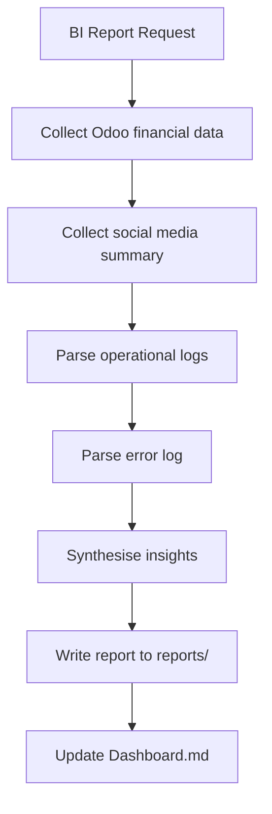

# Business Intelligence Skill

**Skill ID:** SKILL-014
**Status:** Active
**Created:** 2026-03-09
**Last Updated:** 2026-03-09
**Tier:** Gold

---

## Purpose

The Business Intelligence Agent collects, analyses, and synthesises data from all system sources — Odoo financials, social media activity, email logs, and operational logs — to produce actionable insights and executive-level reports.

---

## Data Sources

| Source | Data Collected | Tool/File |
|--------|---------------|-----------|
| Odoo Accounting | Revenue, invoices, payments, overdue | `mcp__odoo-accounting__get_financial_summary` |
| Social Media | Post counts, engagement, platforms | `mcp__meta-social__get_social_summary` + `logs/twitter_activity.log` |
| Email | Sent, pending approval, delivery status | `logs/email_sender_mcp.log` |
| Operations | Task throughput, error rate | `logs/ralph_loop.log`, `logs/error_log.md` |
| Marketing | Posts published, platforms used | `logs/marketing_activity.log`, `logs/linkedin_post.log` |

---

## Workflow



---

## Step-by-Step Instructions

### Step 1 — Collect Financial Data
Call `mcp__odoo-accounting__get_financial_summary`.

Extract:
- Revenue this month
- Open invoices count and total
- Overdue invoices
- Draft invoices pending

If Odoo is unavailable, log the gap and proceed with other sources.

### Step 2 — Collect Social Media Data
Call `mcp__meta-social__get_social_summary`.

Parse `logs/twitter_activity.log` and `logs/linkedin_post.log` for:
- Total posts per platform
- DRY RUN vs live post counts
- Error count

### Step 3 — Parse Operational Logs

Read `logs/ralph_loop.log`:
- Count tasks processed
- Count tasks escalated
- Count errors

Read `logs/error_log.md`:
- Group errors by component
- Identify recurring failure patterns

### Step 4 — Synthesise Insights

Generate insights based on data:

| Metric | Threshold | Insight |
|--------|-----------|---------|
| Overdue invoices > 0 | Any | Follow up on overdue accounts |
| Error rate > 10% | Tasks | Investigate system reliability |
| Social posts < 3/week | Weekly | Increase posting frequency |
| Revenue < previous month | Monthly | Review pipeline and leads |

### Step 5 — Write Report
Save report to `reports/` with format:
```
reports/BI_Report_YYYY-MM-DD.md
```

Report sections:
1. Executive Summary
2. Financial Overview
3. Marketing Activity
4. Operational Health
5. Error Analysis
6. Recommendations

### Step 6 — Update Dashboard
Add BI report completion to Dashboard.md today's log.

---

## Report Template

```markdown
# Business Intelligence Report

**Period:** YYYY-MM-DD to YYYY-MM-DD
**Generated:** YYYY-MM-DD HH:MM
**Prepared by:** Business_Intelligence Agent (SKILL-014)

---

## Executive Summary
[3–5 bullet points of top insights]

## Financial Overview
| Metric | Value |
| Revenue MTD | $X,XXX |
| Open Invoices | N |
| Overdue Invoices | N |
| Paid This Month | N |

## Marketing Activity
| Platform | Posts | Live | Simulated |
| LinkedIn | N | N | N |
| Twitter | N | N | N |
| Facebook | N | N | N |
| Instagram | N | N | N |

## Operational Health
| Metric | Value |
| Tasks Processed | N |
| Tasks Escalated | N |
| Error Rate | X% |

## Error Analysis
[Summary of errors by component]

## Recommendations
1. [Action item 1]
2. [Action item 2]
3. [Action item 3]
```

---

## Logging

```
logs/bi_activity.log
```

Format:
```
[YYYY-MM-DD HH:MM:SS] [BUSINESS_INTELLIGENCE] [REPORT_GENERATED] - reports/BI_Report_2026-03-09.md
[YYYY-MM-DD HH:MM:SS] [BUSINESS_INTELLIGENCE] [DATA_COLLECTED] - Source: Odoo | Revenue MTD: $5,000
[YYYY-MM-DD HH:MM:SS] [BUSINESS_INTELLIGENCE] [ERROR] - Odoo unavailable, skipped financial data
```

---

## Error Handling

| Scenario | Action |
|----------|--------|
| Odoo unavailable | Log gap, use cached data or note "N/A" in report |
| Log file missing | Note absence in report, continue |
| Report write fails | Log error, retry with timestamp suffix |

---

## Integration Points

### Calls:
- `mcp__odoo-accounting__get_financial_summary`
- `mcp__meta-social__get_social_summary`

### Reads:
- `logs/ralph_loop.log`
- `logs/error_log.md`
- `logs/email_sender_mcp.log`
- `logs/marketing_activity.log`
- `logs/twitter_activity.log`
- `logs/linkedin_post.log`

### Writes:
- `reports/BI_Report_YYYY-MM-DD.md`
- `logs/bi_activity.log`

### Related Skills:
- [[skills/Weekly_Business_Audit]] — SKILL-020 (uses BI data)
- [[skills/Weekly_CEO_Briefing]] — SKILL-005
- [[skills/Reporting]] — SKILL-004

---

## Version History

| Version | Date | Changes |
|---------|------|---------|
| 1.0 | 2026-03-09 | Initial Gold Tier creation |

---

*This skill is managed by AI Employee v2.0 — Gold Tier*
