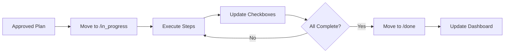

# Execution Skill

**Skill ID:** SKILL-003
**Status:** Active
**Last Updated:** 2026-01-24

---

## Purpose

Execute approved plans and manage task lifecycle from start to completion.

---

## Workflow



---

## Task Lifecycle

```
/needs_action → /in_progress → /done
```

| Stage | Description |
|-------|-------------|
| `needs_action` | Awaiting plan or approval |
| `in_progress` | Actively being worked on |
| `done` | Completed and archived |

---

## Procedure

### Step 1: Initiate Execution
- [ ] Verify plan is approved
- [ ] Move task file from `/needs_action` to `/in_progress`
- [ ] Add execution start timestamp
- [ ] Update Dashboard status

### Step 2: Execute Plan Steps
For each step in the plan:
- [ ] Read step requirements
- [ ] Perform the action
- [ ] Document outcome
- [ ] Check off completed step
- [ ] Update progress in Dashboard

### Step 3: Handle Blockers
If a blocker is encountered:
- [ ] Document the blocker in task file
- [ ] Create approval request if human input needed
- [ ] Add `#blocked` tag
- [ ] Update Dashboard with blocker status
- [ ] Wait for resolution

### Step 4: Complete Task
When all steps are done:
- [ ] Verify all checkboxes complete
- [ ] Add completion timestamp
- [ ] Move task from `/in_progress` to `/done`
- [ ] Update Dashboard counters
- [ ] Create completion log entry

### Step 5: Archive & Report
- [ ] Generate completion summary
- [ ] Link deliverables
- [ ] Update client folder if applicable
- [ ] Trigger Reporting skill

---

## Status Tags

| Tag | Meaning |
|-----|---------|
| `#active` | Currently being worked |
| `#blocked` | Waiting on external input |
| `#review` | Awaiting human review |
| `#complete` | Finished |

---

## Execution Log Format

```markdown
## Execution Log

| Timestamp | Step | Action | Result |
|-----------|------|--------|--------|
| 2026-01-24 10:00 | 1 | [Action] | Success/Failed |
```

---

## Error Handling

1. **Step Failure**
   - Document error
   - Attempt recovery if safe
   - Escalate if critical

2. **Missing Resource**
   - Log the gap
   - Request via approval file
   - Pause execution

3. **Scope Creep**
   - Note in task file
   - Request guidance
   - Do not proceed beyond original scope

---

## Output

- Updated task file with execution log
- Completed task in `/done`
- Dashboard update
- Log entry in `/logs`

---

## Related Skills

- [[Planning]] - Source of execution plans
- [[Reporting]] - Completion notifications
- [[Task_Intake]] - New work pipeline

---

*This skill is managed by AI Employee v1.0*
