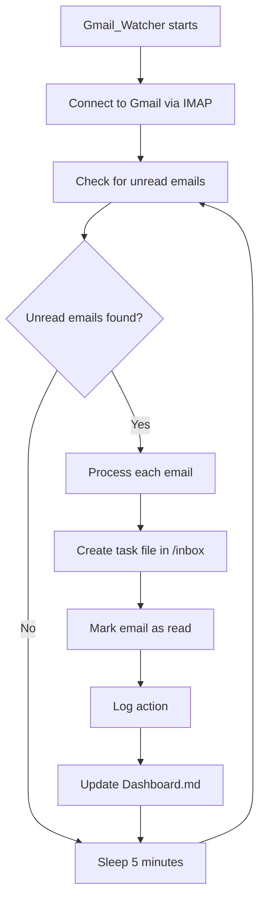

# Gmail Watcher Skill

**Skill ID:** SKILL-007
**Status:** Active
**Created:** 2026-02-14
**Last Updated:** 2026-02-14

---

## Purpose

Continuously monitor a Gmail inbox via IMAP (read-only connection) and automatically convert unread emails into actionable task files in `/inbox`. This enables the AI Employee pipeline to process email-driven work without manual intervention.

---

## Position in Pipeline

```
Gmail (IMAP) → Gmail_Watcher → /inbox → Task_Intake → Reasoning_Planner → Execution → /done
```

This skill operates **upstream** of all other skills. It feeds the pipeline by converting emails into task files that Task_Intake can process.

---

## Workflow



---

## Procedure

### Step 1: Connect to Gmail

- [ ] Load credentials from `.env` file
- [ ] Connect to `imap.gmail.com:993` via SSL
- [ ] Authenticate with email + App Password
- [ ] Select INBOX folder (read-only initial scan)

### Step 2: Check Unread Emails (Every 5 Minutes)

- [ ] Search for messages with `UNSEEN` flag
- [ ] Fetch email headers and body for each result
- [ ] Extract: From, Subject, Date, Body snippet (first 500 chars)

### Step 3: Create Task File in `/inbox`

**Filename Convention:** `email_<date>_<subject>.md`
- All lowercase
- Spaces replaced with underscores
- Special characters removed
- Date format: `YYYY-MM-DD`
- Example: `email_2026-02-14_quarterly_budget_review.md`

**Task File Template:**

```markdown
# Email Task: {Subject}

**Created:** {YYYY-MM-DD HH:MM}
**Source:** Gmail Watcher (SKILL-007)
**Priority:** #medium

---

## Email Details

| Field | Value |
|-------|-------|
| **From** | {sender_name} <{sender_email}> |
| **Subject** | {subject_line} |
| **Date Received** | {email_date} |

---

## Body Snippet

{first 500 characters of email body, plain text}

---

## Suggested Action

{AI-generated suggestion based on email content}

**Possible actions:**
- [ ] Reply needed
- [ ] Task to execute
- [ ] File for reference
- [ ] Forward to client folder
- [ ] Schedule follow-up

---

*Generated by Gmail_Watcher (SKILL-007)*
```

### Step 4: Mark Email as Read

- [ ] After successfully creating the task file, mark the email as `\Seen`
- [ ] This prevents duplicate processing on the next check cycle

### Step 5: Log All Actions

- [ ] Log each email processed to `/logs/gmail_watcher.log`
- [ ] Log format: `[YYYY-MM-DD HH:MM:SS] [GMAIL_WATCHER] [ACTION] - [DETAILS]`
- [ ] Update `/logs/Skill_Usage_Log.md` with summary entries

### Step 6: Update Dashboard

- [ ] Update Dashboard.md inbox count when new tasks are created
- [ ] Add entry to Today's Log section

---

## Configuration

### Required Environment Variables (`.env`)

```
GMAIL_ADDRESS=your.email@gmail.com
GMAIL_APP_PASSWORD=xxxx-xxxx-xxxx-xxxx
GMAIL_CHECK_INTERVAL=300
```

### Gmail App Password Setup

1. Go to Google Account > Security
2. Enable 2-Factor Authentication (required)
3. Go to App Passwords (search in account settings)
4. Generate an App Password for "Mail"
5. Copy the 16-character password into `.env`

**Important:** Do NOT use your regular Gmail password. App Passwords are required for IMAP access.

---

## Suggested Action Logic

The skill analyzes email content to suggest an appropriate action:

| Email Contains | Suggested Action |
|---------------|-----------------|
| Question / "?" | Reply needed |
| "Please do" / "Can you" / request language | Task to execute |
| "FYI" / "For your information" / newsletter | File for reference |
| Client name / project reference | Forward to client folder |
| Date / time / "meeting" / "deadline" | Schedule follow-up |
| Invoice / payment / "attached" | Review attachment / financial action |

---

## Error Handling

| Scenario | Action |
|----------|--------|
| IMAP connection fails | Log error, retry in 5 minutes |
| Authentication fails | Log critical error, stop watcher, alert on Dashboard |
| Email parse error | Log warning, skip email, continue processing others |
| File write error | Log error, retry once, mark as failed if persists |
| Network timeout | Log warning, retry connection in 1 minute |
| Duplicate detection | Check if task file already exists, skip if so |

---

## Logging Requirements

Every action must log:

```
[YYYY-MM-DD HH:MM:SS] [GMAIL_WATCHER] [ACTION] - [DETAILS]
```

**Required Log Entries:**
1. Watcher started: `[START] Gmail Watcher initialized`
2. Connection: `[CONNECT] IMAP connection established`
3. Check cycle: `[CHECK] Scanning for unread emails...`
4. Email found: `[FOUND] {count} unread email(s)`
5. Task created: `[TASK_CREATED] File: {filename}`
6. Email marked: `[MARKED_READ] Subject: {subject}`
7. Error: `[ERROR] {error_description}`
8. Cycle complete: `[CYCLE_COMPLETE] Processed {count} emails, sleeping {interval}s`

---

## Integration Points

### Output To:
- `/inbox` folder - Task files for pipeline processing
- `/logs/gmail_watcher.log` - Dedicated watcher log
- `/logs/Skill_Usage_Log.md` - Master audit trail
- `Dashboard.md` - Status updates

### Triggers:
- [[skills/Task_Intake]] - Picks up created task files from `/inbox`

### Dependencies:
- Python 3.7+
- `python-dotenv` package (for .env loading)
- Gmail account with App Password configured
- Network/internet access

---

## Running the Watcher

```bash
# Install dependencies
pip install python-dotenv

# Configure credentials
# Edit .env with your Gmail address and App Password

# Start the watcher
python gmail_watcher.py

# Run in background (Linux/Mac)
nohup python gmail_watcher.py &

# Run in background (Windows)
start /B python gmail_watcher.py
```

---

## Security Notes

- Credentials stored in `.env` (excluded from git via `.gitignore`)
- IMAP connection uses SSL/TLS encryption
- App Passwords can be revoked at any time from Google Account
- No email content is sent externally - all processing is local
- Body snippets are truncated to 500 chars to limit data exposure

---

## Example Execution

**Input:** Unread email in Gmail

```
From: jane@clientco.com
Subject: Q1 Budget Review Meeting
Date: 2026-02-14 09:30
Body: Hi, can we schedule a meeting to review the Q1 budget
      numbers? I have some concerns about the marketing spend...
```

**Output:** `/inbox/email_2026-02-14_q1_budget_review_meeting.md`

```markdown
# Email Task: Q1 Budget Review Meeting

**Created:** 2026-02-14 09:35
**Source:** Gmail Watcher (SKILL-007)
**Priority:** #medium

---

## Email Details

| Field | Value |
|-------|-------|
| **From** | jane@clientco.com |
| **Subject** | Q1 Budget Review Meeting |
| **Date Received** | 2026-02-14 09:30 |

---

## Body Snippet

Hi, can we schedule a meeting to review the Q1 budget numbers? I have some
concerns about the marketing spend...

---

## Suggested Action

Schedule follow-up - Email contains meeting request and date references.

**Possible actions:**
- [ ] Reply needed
- [ ] Task to execute
- [ ] File for reference
- [ ] Forward to client folder
- [x] Schedule follow-up

---

*Generated by Gmail_Watcher (SKILL-007)*
```

---

## Related Skills

- [[skills/Task_Intake]] - Processes task files created by this skill
- [[skills/Reporting]] - Logs activities from this skill
- [[skills/reasoning_planner]] - Plans actions for email-derived tasks

---

## Version History

| Version | Date | Changes |
|---------|------|---------|
| 1.0 | 2026-02-14 | Initial skill creation |

---

*This skill is managed by AI Employee v1.1*
*Emails become actions - no inbox left behind*
