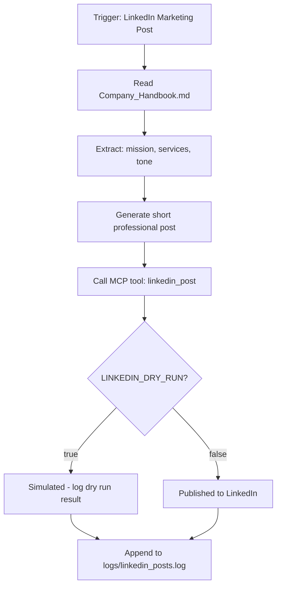

# LinkedIn Marketing Post Skill

**Skill ID:** SKILL-010
**Status:** Active
**Created:** 2026-03-06
**Last Updated:** 2026-03-06

---

## Purpose

Generate and publish professional LinkedIn posts to promote AI automation services. Reads business context from `Company_Handbook.md`, crafts a focused marketing message, publishes via the `linkedin_post` MCP tool, and logs the result.

---

## Position in Pipeline

```
Company_Handbook.md
        │
        ▼
  Claude generates post
        │
        ▼
MCP tool: linkedin_post
        │
   ┌────┴────┐
   │         │
DRY_RUN    Publish
  =true     =false
   │         │
  Log       LinkedIn
simulated   published
   │         │
   └────┬────┘
        ▼
logs/linkedin_posts.log
```

---

## Workflow



---

## Step-by-Step Instructions

### Step 1 — Read Business Context

Read `Company_Handbook.md` and extract:
- Company mission and value proposition
- Core services offered
- Tone and communication style
- Any relevant highlights (new offerings, milestones, etc.)

### Step 2 — Generate Marketing Post

Craft a LinkedIn post following these rules:
- **Length:** 3–6 sentences (under 300 characters preferred, 3000 max)
- **Tone:** Professional, confident, approachable
- **Structure:**
  1. Hook — a bold or relatable opening line
  2. Value — what problem is solved or what is offered
  3. CTA — call to action (e.g. "DM to collaborate", "Comment below", "Learn more")
- **No hashtag spam** — use 2–4 targeted hashtags max
- Do not fabricate specific metrics or client names unless confirmed in the handbook

**Example post format:**
```
[Hook sentence.]

[1–2 sentences on value/service.]

[Call to action.]

#AIAutomation #BusinessGrowth
```

### Step 3 — Call `linkedin_post` MCP Tool

Invoke the MCP tool with the generated content:

```
Tool: linkedin_post
  content: "<generated post text>"
```

**Response handling:**
- `{"success": true, "dry_run": true}` → post was simulated (LINKEDIN_DRY_RUN=true)
- `{"success": true, "dry_run": false}` → post was published live
- `{"success": false, ...}` → log the error, do not retry automatically

### Step 4 — Log Result

Append a structured entry to `logs/linkedin_posts.log`:

```
[YYYY-MM-DD HH:MM:SS] [LINKEDIN] [ACTION] - <summary>
```

**Log actions:**
- `PUBLISHED` — post sent live to LinkedIn
- `DRY_RUN` — post simulated, not published
- `ERROR` — tool call failed; include error message

---

## Configuration

### Environment Variable (`.env`)

```
LINKEDIN_DRY_RUN=true
```

| Value | Behaviour |
|-------|-----------|
| `true` | Post is simulated. No content published. Safe for testing. |
| `false` | Post is published live to LinkedIn via MCP server. |

### MCP Configuration (`.mcp.json`)

```json
{
  "mcpServers": {
    "linkedin-poster": {
      "command": "python",
      "args": ["mcp_servers/linkedin_poster.py"],
      "env": {}
    }
  }
}
```

---

## Trigger Conditions

This skill is invoked when:
- User requests a LinkedIn post directly (e.g. "post to LinkedIn", "create a marketing post")
- A scheduled or automated marketing task references SKILL-010
- Another skill delegates social media publishing to this skill

---

## Logging

All results are appended to `logs/linkedin_posts.log`.

**Format:**
```
[2026-03-06 14:00:00] [LINKEDIN] [PUBLISHED] - "Excited to help businesses automate operations..."
[2026-03-06 14:05:00] [LINKEDIN] [DRY_RUN]   - Post simulated. LINKEDIN_DRY_RUN=true
[2026-03-06 14:10:00] [LINKEDIN] [ERROR]      - MCP tool returned success=false: <reason>
```

---

## Error Handling

| Scenario | Action |
|----------|--------|
| `Company_Handbook.md` missing or empty | Generate generic AI automation post; log warning |
| MCP tool returns `success: false` | Log error, surface to user, do not retry |
| Post content exceeds 3000 characters | Trim to last complete sentence before limit |
| LINKEDIN_DRY_RUN not set | Default to `true` (safe mode) |

---

## Integration Points

### Reads:
- `Company_Handbook.md` — business context for post generation

### Calls:
- `mcp__linkedin-poster__linkedin_post` — MCP tool to publish or simulate post

### Writes:
- `logs/linkedin_posts.log` — audit trail of all post attempts

### Related Skills:
- [[skills/Reporting]] — can include LinkedIn activity in weekly reports
- [[skills/Weekly_CEO_Briefing]] — may reference published posts
- [[skills/email_sender_mcp]] — sibling MCP-based outbound communication skill

---

## Example Usage

### Dry-run (safe mode)
```
User: Post to LinkedIn about our AI automation services.

Step 1: Read Company_Handbook.md
Step 2: Generate post:
  "Businesses waste hours on tasks AI can handle in seconds.
   We build custom AI automation systems that free your team
   to focus on growth. DM to see what's possible.
   #AIAutomation #OperationsAI"

Step 3: Call linkedin_post
  → {"success": true, "dry_run": true, "message": "LinkedIn post simulated"}

Step 4: Log
  [2026-03-06 14:00:00] [LINKEDIN] [DRY_RUN] - Post simulated. LINKEDIN_DRY_RUN=true
```

### Live publish
```
(Same as above with LINKEDIN_DRY_RUN=false)

Step 3: Call linkedin_post
  → {"success": true, "dry_run": false, "message": "Post published"}

Step 4: Log
  [2026-03-06 14:00:00] [LINKEDIN] [PUBLISHED] - "Businesses waste hours on tasks AI..."
```

---

## Related Skills

- [[skills/Reporting]] — Weekly activity reports
- [[skills/Weekly_CEO_Briefing]] — Executive summaries
- [[skills/email_sender_mcp]] — Outbound email (SKILL-009)
- [[skills/Execution]] — Task execution engine

---

## Version History

| Version | Date | Changes |
|---------|------|---------|
| 1.0 | 2026-03-06 | Initial skill creation |

---

*This skill is managed by AI Employee v1.1*
*Think before you post — or simulate first.*
