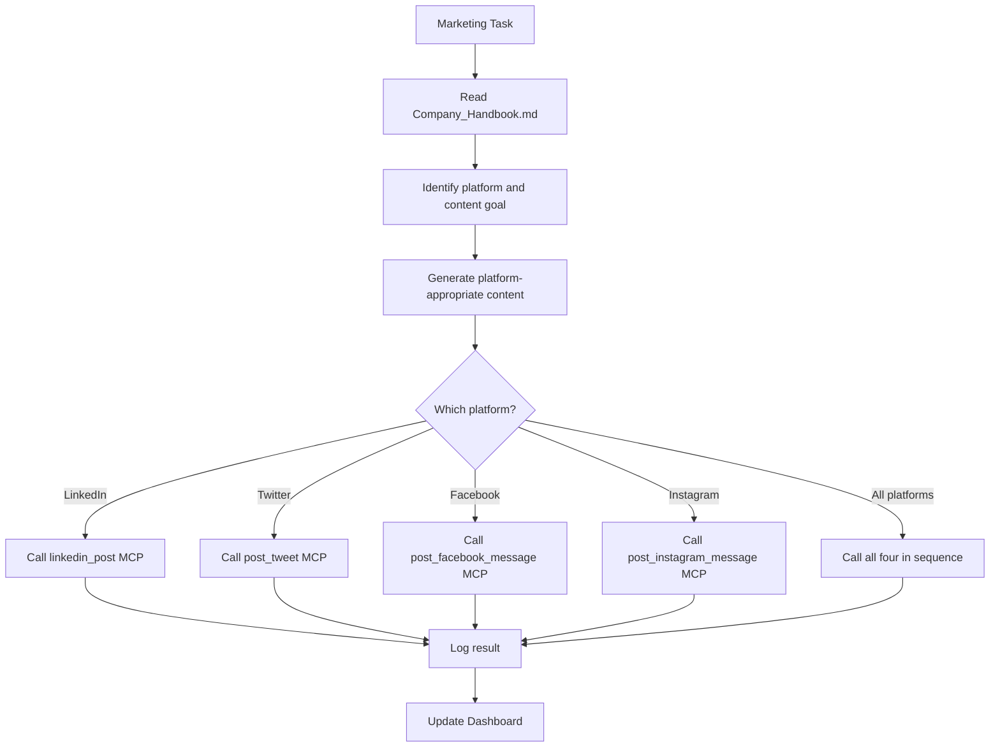

# Marketing Agent Skill

**Skill ID:** SKILL-012
**Status:** Active
**Created:** 2026-03-09
**Last Updated:** 2026-03-09
**Tier:** Gold

---

## Purpose

The Marketing Agent manages all outbound social media and content marketing activity. It generates platform-appropriate content from business context, calls the correct MCP publishing tool, and tracks performance across LinkedIn, Twitter/X, Facebook, and Instagram.

---

## Platforms Managed

| Platform | MCP Tool | Log File | Dry-Run Variable |
|----------|----------|----------|-----------------|
| LinkedIn | `mcp__linkedin-poster__linkedin_post` | `logs/linkedin_post.log` | `LINKEDIN_DRY_RUN` |
| Twitter/X | `mcp__twitter-poster__post_tweet` | `logs/twitter_activity.log` | `TWITTER_DRY_RUN` |
| Facebook | `mcp__meta-social__post_facebook_message` | `logs/meta_social.log` | `META_DRY_RUN` |
| Instagram | `mcp__meta-social__post_instagram_message` | `logs/meta_social.log` | `META_DRY_RUN` |

---

## Workflow



---

## Step-by-Step Instructions

### Step 1 — Read Business Context
Read `Company_Handbook.md` and extract:
- Company mission and services
- Target audience
- Tone of voice (professional / casual / authoritative)
- Any specific campaign or announcement

### Step 2 — Determine Platform Strategy

| Platform | Content Style | Length | Hashtags |
|----------|--------------|--------|----------|
| LinkedIn | Professional, thought-leadership | 150–300 words | 3–5 |
| Twitter/X | Punchy, direct, conversational | Max 280 chars | 2–3 |
| Facebook | Friendly, community-focused | 50–200 words | 2–4 |
| Instagram | Visual caption, engaging | 50–150 words | 5–10 |

### Step 3 — Generate Content

Post structure:
1. **Hook** — Bold or relatable opening
2. **Value** — Problem solved or insight shared
3. **CTA** — Call to action ("DM to collaborate", "Link in bio", "Comment below")
4. **Hashtags** — Targeted, not spammy

Do not fabricate metrics or testimonials unless provided by the user.

### Step 4 — Publish via MCP Tool
Call the appropriate MCP tool(s). Respect DRY_RUN settings.

### Step 5 — Log and Report
- Log result to platform log file
- Append summary to `logs/marketing_activity.log`
- Optionally call `get_social_summary` to generate `reports/social_summary.md`

---

## Content Templates

### LinkedIn
```
[Hook — bold statement or question]

[2–3 sentences on value proposition or insight]

[CTA — e.g., "DM me to explore what AI can do for your business."]

#AIAutomation #BusinessGrowth #OperationsAI
```

### Twitter/X
```
[Hook in under 100 chars] [Value in 1 sentence] [CTA] #AI #Automation
```

### Facebook
```
[Friendly opener]

[2–3 sentences with value or story]

[Question to drive engagement or CTA]
```

### Instagram
```
[Engaging caption]

[Value or insight]

[CTA — e.g., "Link in bio for more."]

#AI #Automation #BusinessGrowth #DigitalTransformation #Productivity
```

---

## Logging

```
logs/marketing_activity.log
```

Format:
```
[YYYY-MM-DD HH:MM:SS] [MARKETING] [PUBLISHED] - Platform: LinkedIn | Length: 250 chars
[YYYY-MM-DD HH:MM:SS] [MARKETING] [DRY_RUN]   - Platform: Twitter | Simulated
[YYYY-MM-DD HH:MM:SS] [MARKETING] [ERROR]      - Platform: Facebook | reason
```

---

## Error Handling

| Scenario | Action |
|----------|--------|
| MCP tool returns `success: false` | Log error, do not retry automatically, surface to user |
| Content exceeds platform limit | Trim to last complete sentence before limit |
| DRY_RUN not set | Default to `true` (safe mode) |
| All platforms failing | Create recovery task in `/needs_action` |

---

## Integration Points

### Calls:
- `mcp__linkedin-poster__linkedin_post`
- `mcp__twitter-poster__post_tweet`
- `mcp__meta-social__post_facebook_message`
- `mcp__meta-social__post_instagram_message`
- `mcp__meta-social__get_social_summary`

### Reads:
- `Company_Handbook.md`

### Writes:
- `logs/marketing_activity.log`
- `reports/social_summary.md` (via get_social_summary)

### Related Skills:
- [[skills/LinkedIn_Marketing_Post]] — SKILL-010 (LinkedIn-specific)
- [[skills/Social_Media_Manager]] — SKILL-015 (scheduling and strategy)
- [[skills/Weekly_Business_Audit]] — SKILL-020 (includes marketing data)

---

## Version History

| Version | Date | Changes |
|---------|------|---------|
| 1.0 | 2026-03-09 | Initial Gold Tier creation |

---

*This skill is managed by AI Employee v2.0 — Gold Tier*
