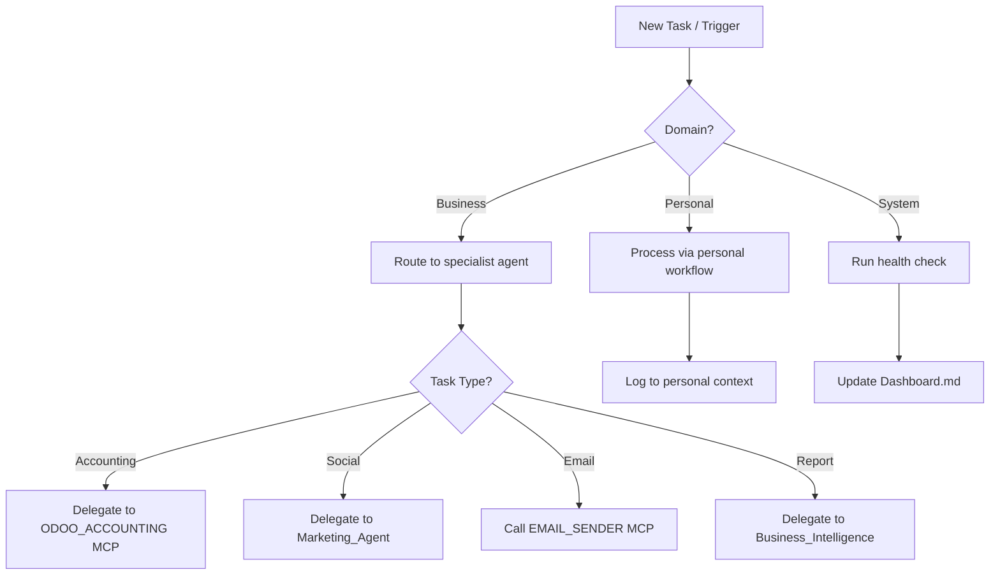

# Operations Agent Skill

**Skill ID:** SKILL-011
**Status:** Active
**Created:** 2026-03-09
**Last Updated:** 2026-03-09
**Tier:** Gold

---

## Purpose

The Operations Agent handles day-to-day operational tasks across both personal and business domains. It routes incoming tasks to the correct specialist agent or MCP tool, monitors system health, and ensures the vault's file pipeline stays clean and current.

---

## Responsibilities

| Domain | Tasks Handled |
|--------|--------------|
| Business | Client onboarding, invoice tracking, task routing, file pipeline |
| Personal | Reminders, appointments, personal task intake |
| System | Health checks, log review, folder maintenance |

---

## Workflow



---

## Step-by-Step Instructions

### Step 1 — Receive Task
Read the incoming task from `/inbox`. Extract:
- Task title and description
- Domain (business / personal)
- Priority (high / medium / low)
- Deadline (if any)

### Step 2 — Classify and Route
Use the classification matrix:

| Keyword Signals | Route To |
|-----------------|----------|
| invoice, payment, odoo, customer | ODOO_ACCOUNTING MCP |
| post, linkedin, tweet, facebook, instagram | Marketing_Agent (SKILL-012) |
| email, send, reply | EMAIL_SENDER MCP |
| report, audit, summary, briefing | Business_Intelligence (SKILL-014) |
| personal, reminder, appointment | Personal workflow (log + calendar note) |

### Step 3 — Execute or Delegate
- **Direct execution:** Simple tasks (file operations, logging, dashboard updates)
- **MCP delegation:** Any outbound action requiring a tool call
- **Agent delegation:** Complex multi-step tasks requiring specialist logic

### Step 4 — Verify and Log
- Confirm the action completed successfully
- Log to `logs/operations.log`:
  ```
  [TIMESTAMP] [OPERATIONS] [ACTION] - details
  ```
- Update Dashboard.md Current Activity table

### Step 5 — Close Task
- Move task file from `/in_progress` to `/done`
- If failed: create recovery task in `/needs_action`

---

## Logging

```
logs/operations.log
```

Format:
```
[YYYY-MM-DD HH:MM:SS] [OPERATIONS] [ROUTED] - Task: invoice_creation → ODOO_ACCOUNTING
[YYYY-MM-DD HH:MM:SS] [OPERATIONS] [COMPLETED] - Task: personal_reminder logged
[YYYY-MM-DD HH:MM:SS] [OPERATIONS] [ERROR] - Task failed, recovery task created
```

---

## Error Handling

| Scenario | Action |
|----------|--------|
| Unknown task type | Log as `general`, escalate to human via `/needs_action` |
| Delegated agent fails | Create recovery task, notify dashboard |
| MCP tool unavailable | Log error, retry once, then escalate |
| File missing from pipeline | Scan `/in_progress` and reconcile |

---

## Integration Points

### Delegates To:
- `mcp__odoo-accounting__*` — Accounting tasks
- `mcp__email-sender__*` — Email tasks
- [[skills/Marketing_Agent]] — Social and marketing tasks
- [[skills/Business_Intelligence]] — Reporting tasks

### Reads:
- `/inbox` — Incoming tasks
- `Company_Handbook.md` — Business context
- `Dashboard.md` — Current system state

### Writes:
- `logs/operations.log`
- `Dashboard.md` — Activity updates
- `/needs_action` — Recovery/escalation tasks

---

## Related Skills

- [[skills/Marketing_Agent]] — SKILL-012
- [[skills/Sales_Agent]] — SKILL-013
- [[skills/Business_Intelligence]] — SKILL-014
- [[skills/Task_Intake]] — SKILL-001
- [[skills/Execution]] — SKILL-003

---

## Version History

| Version | Date | Changes |
|---------|------|---------|
| 1.0 | 2026-03-09 | Initial Gold Tier creation |

---

*This skill is managed by AI Employee v2.0 — Gold Tier*
