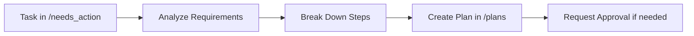

# Planning Skill

**Skill ID:** SKILL-002
**Status:** Active
**Last Updated:** 2026-01-24

---

## Purpose

Create detailed, actionable step-by-step plans for every task in `/needs_action`.

---

## Workflow



---

## Procedure

### Step 1: Task Analysis
- [ ] Read task file from `/needs_action`
- [ ] Identify objectives and deliverables
- [ ] Assess complexity level
- [ ] Check for dependencies

### Step 2: Resource Assessment
- [ ] Identify required resources
- [ ] Check client folder for context (`/clients`)
- [ ] Review related past plans

### Step 3: Create Plan Document
Location: `/plans/PLAN_TaskName_Date.md`

**Plan Template:**
```markdown
# Plan: [Task Name]

**Created:** YYYY-MM-DD
**Status:** Draft | Awaiting Approval | Approved | In Progress | Complete
**Task Reference:** [[original task file]]
**Priority:** High | Medium | Low

---

## Objective
[Clear statement of what needs to be accomplished]

## Steps

- [ ] Step 1: [Action]
  - Details:
  - Resources needed:
  - Estimated effort:

- [ ] Step 2: [Action]
  ...

## Success Criteria
- [ ] Criterion 1
- [ ] Criterion 2

## Risks & Mitigations
| Risk | Impact | Mitigation |
|------|--------|------------|
|      |        |            |

## Approval Required
- [ ] Human approval needed: Yes/No
- [ ] Approval status: Pending/Approved

## Notes
[Additional context]
```

### Step 4: Approval Workflow
- [ ] If human approval required:
  - Create approval request file
  - Wait for confirmation
  - Update plan status
- [ ] If auto-approved:
  - Mark as approved
  - Proceed to execution

### Step 5: Handoff to Execution
- [ ] Link plan to original task
- [ ] Update task status
- [ ] Notify via Dashboard

---

## Planning Principles

1. **Atomic Steps** - Each step should be a single action
2. **Measurable** - Clear completion criteria
3. **Sequenced** - Logical order of operations
4. **Resourced** - All dependencies identified
5. **Timeboxed** - Effort estimates where possible

---

## Output

- Plan document in `/plans`
- Updated task file with plan link
- Dashboard notification

---

## Related Skills

- [[Task_Intake]] - Source of tasks
- [[Execution]] - Implements the plan
- [[Reporting]] - Progress tracking

---

*This skill is managed by AI Employee v1.0*
