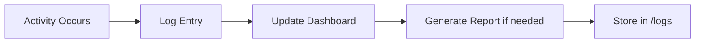

# Reporting Skill

**Skill ID:** SKILL-004
**Status:** Active
**Last Updated:** 2026-01-24

---

## Purpose

Generate clear, auditable reports and maintain comprehensive documentation of all activities.

---

## Workflow



---

## Report Types

### 1. Daily Activity Log
**Location:** `/logs/daily/YYYY-MM-DD.md`

```markdown
# Daily Log: YYYY-MM-DD

## Summary
- Tasks Processed: X
- Tasks Completed: X
- Tasks In Progress: X
- Blockers: X

## Activity Timeline

| Time | Action | Task | Status |
|------|--------|------|--------|
|      |        |      |        |

## Notes
[Any important observations]
```

### 2. Task Completion Report
**Location:** `/logs/completions/TaskName_Complete.md`

```markdown
# Completion Report: [Task Name]

**Completed:** YYYY-MM-DD HH:MM
**Duration:** [Start to End]
**Plan Reference:** [[Plan file]]

## Deliverables
- [ ] Deliverable 1 - [[Link]]
- [ ] Deliverable 2 - [[Link]]

## Execution Summary
[Brief narrative of what was done]

## Issues Encountered
[Any problems and how they were resolved]

## Lessons Learned
[Improvements for future tasks]
```

### 3. Weekly Summary
**Location:** `/logs/weekly/Week_XX_YYYY.md`

```markdown
# Weekly Summary: Week XX, YYYY

## Metrics
| Metric | Count |
|--------|-------|
| Tasks Received | |
| Tasks Completed | |
| Tasks Pending | |
| Approval Requests | |

## Highlights
-

## Challenges
-

## Next Week Focus
-
```

### 4. Client Report
**Location:** `/clients/[ClientName]/Reports/`

```markdown
# Client Report: [Client Name]

**Period:** YYYY-MM-DD to YYYY-MM-DD

## Work Completed
-

## Pending Items
-

## Recommendations
-
```

---

## Dashboard Updates

The Dashboard.md file serves as the central status display:

### Required Updates
- [ ] Task counters (inbox, needs_action, in_progress, done)
- [ ] Current active task
- [ ] Recent completions
- [ ] Blockers/alerts
- [ ] Last activity timestamp

### Update Triggers
- Task intake
- Status change
- Task completion
- Blocker identified
- Approval received

---

## Logging Standards

### Entry Format
```
[YYYY-MM-DD HH:MM] [SKILL] [ACTION] - [DETAILS]
```

**Example:**
```
[2026-01-24 14:30] [EXECUTION] [COMPLETE] - Task "Client Proposal" finished
```

### Log Levels
| Level | Use Case |
|-------|----------|
| INFO | Normal operations |
| WARN | Potential issues |
| ERROR | Failures requiring attention |
| SUCCESS | Completed actions |

---

## Audit Trail Requirements

All reports must include:
1. Timestamp of creation
2. Reference to source task/action
3. Clear outcome statement
4. Links to related files

---

## Output

- Log files in `/logs`
- Updated Dashboard.md
- Client reports in `/clients/[name]/Reports`
- Completion certificates

---

## Related Skills

- [[Task_Intake]] - Logs new tasks
- [[Planning]] - Logs plans created
- [[Execution]] - Logs execution progress

---

*This skill is managed by AI Employee v1.0*
