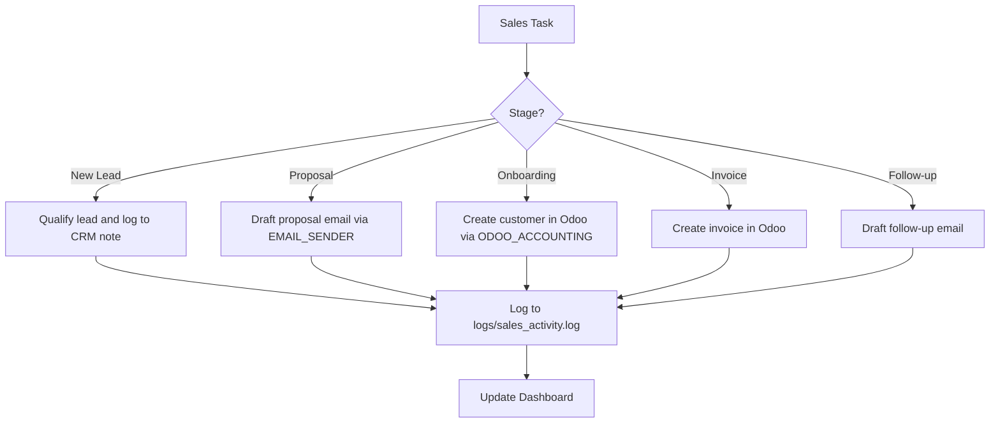

# Sales Agent Skill

**Skill ID:** SKILL-013
**Status:** Active
**Created:** 2026-03-09
**Last Updated:** 2026-03-09
**Tier:** Gold

---

## Purpose

The Sales Agent manages the end-to-end sales pipeline: lead qualification, proposal generation, client onboarding in Odoo, invoice creation, and follow-up communication. It bridges marketing activity and accounting to close deals and maintain client relationships.

---

## Pipeline Stages

```
Lead Identified → Qualified → Proposal Sent → Invoice Created → Payment Received → Client Onboarded
```

---

## Workflow



---

## Step-by-Step Instructions

### Step 1 — Identify Stage
Read the task and determine the pipeline stage. Look for keywords:

| Keywords | Stage |
|----------|-------|
| lead, prospect, inquiry, interested | Lead Qualification |
| proposal, quote, offer, pricing | Proposal |
| onboard, new client, contract signed | Onboarding |
| invoice, bill, payment due | Invoicing |
| follow up, no response, overdue | Follow-up |

### Step 2 — Execute Stage Actions

**Lead Qualification:**
- Extract: name, company, need, budget (if mentioned)
- Log lead details
- Flag for human review if budget is significant

**Proposal:**
- Draft professional proposal email
- Call `request_email_approval` (never send proposals without human approval)

**Onboarding:**
- Call `mcp__odoo-accounting__create_customer` with client details
- Confirm customer ID returned
- Log onboarding complete

**Invoicing:**
- Call `mcp__odoo-accounting__create_invoice`
- Include: customer name, amount, service description
- Log invoice ID

**Follow-up:**
- Draft follow-up email
- Call `request_email_approval` for human review before sending

### Step 3 — Log and Update
- Append to `logs/sales_activity.log`
- Update Dashboard.md with pipeline activity

---

## Approval Rules

| Action | Approval Required |
|--------|------------------|
| Send proposal email | Yes — always via `request_email_approval` |
| Create customer in Odoo | No — auto-approved |
| Create invoice | No — auto-approved |
| Send follow-up email | Yes — via `request_email_approval` |
| Record payment | No — auto-approved |

---

## Logging

```
logs/sales_activity.log
```

Format:
```
[YYYY-MM-DD HH:MM:SS] [SALES] [LEAD_QUALIFIED] - Name: John Smith, Company: Acme Corp
[YYYY-MM-DD HH:MM:SS] [SALES] [INVOICE_CREATED] - Invoice INV/2026/001, Amount: $2,500
[YYYY-MM-DD HH:MM:SS] [SALES] [PROPOSAL_QUEUED] - Approval request created for Acme Corp
```

---

## Error Handling

| Scenario | Action |
|----------|--------|
| Odoo customer creation fails | Retry once, then create recovery task |
| Invoice creation fails | Log error, alert dashboard, create recovery task |
| Email approval rejected | Archive with notes, log as closed-lost if applicable |

---

## Integration Points

### Calls:
- `mcp__odoo-accounting__create_customer`
- `mcp__odoo-accounting__create_invoice`
- `mcp__odoo-accounting__record_payment`
- `mcp__email-sender__request_email_approval`

### Reads:
- `Company_Handbook.md`
- `/inbox` — Lead notifications

### Writes:
- `logs/sales_activity.log`
- `/pending_approval` — Proposal and follow-up emails

### Related Skills:
- [[skills/Operations_Agent]] — SKILL-011
- [[skills/Business_Intelligence]] — SKILL-014 (pipeline reporting)
- [[skills/Weekly_Business_Audit]] — SKILL-020

---

## Version History

| Version | Date | Changes |
|---------|------|---------|
| 1.0 | 2026-03-09 | Initial Gold Tier creation |

---

*This skill is managed by AI Employee v2.0 — Gold Tier*
