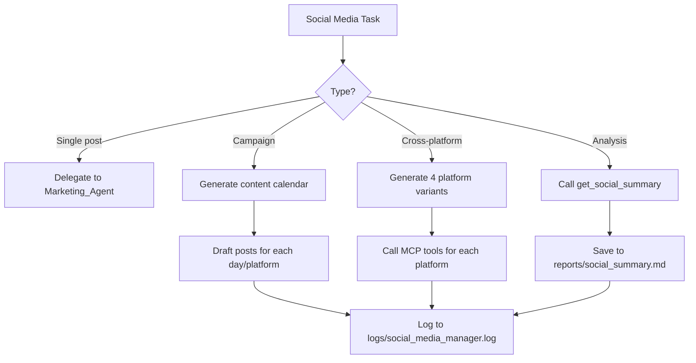

# Social Media Manager Skill

**Skill ID:** SKILL-015
**Status:** Active
**Created:** 2026-03-09
**Last Updated:** 2026-03-09
**Tier:** Gold

---

## Purpose

The Social Media Manager orchestrates content strategy, scheduling, and cross-platform publishing across LinkedIn, Twitter/X, Facebook, and Instagram. It works above the Marketing Agent (SKILL-012), handling calendar planning, content calendars, and performance analysis.

---

## Platforms

| Platform | Tool | Dry-Run Env |
|----------|------|-------------|
| LinkedIn | `mcp__linkedin-poster__linkedin_post` | `LINKEDIN_DRY_RUN` |
| Twitter/X | `mcp__twitter-poster__post_tweet` | `TWITTER_DRY_RUN` |
| Facebook | `mcp__meta-social__post_facebook_message` | `META_DRY_RUN` |
| Instagram | `mcp__meta-social__post_instagram_message` | `META_DRY_RUN` |

---

## Content Calendar Framework

### Recommended Posting Frequency

| Platform | Frequency | Best Times (PKT) |
|----------|-----------|-----------------|
| LinkedIn | 3–4x/week | Mon–Thu, 9–11 AM |
| Twitter/X | 5–7x/week | Any time, short bursts |
| Facebook | 3–5x/week | Wed–Fri, 12–3 PM |
| Instagram | 3–4x/week | Tue/Thu/Sat, 11 AM |

### Weekly Content Themes

| Day | Theme |
|-----|-------|
| Monday | Motivation / Week kick-off |
| Tuesday | Tips & Insights |
| Wednesday | Case study / Success story |
| Thursday | Industry news / Thought leadership |
| Friday | Behind-the-scenes / Community |

---

## Workflow



---

## Step-by-Step Instructions

### Step 1 — Determine Task Type
- **Single post:** Delegate directly to Marketing_Agent (SKILL-012)
- **Weekly campaign:** Generate content calendar for 5 business days
- **Performance analysis:** Call `get_social_summary`, generate insights
- **Cross-platform push:** Generate platform-appropriate variants, publish all

### Step 2 — Content Generation (Campaign Mode)

For a weekly campaign, generate 5 posts per platform:

1. Read `Company_Handbook.md` for context
2. Apply weekly content themes (see table above)
3. Generate platform-specific variants
4. Queue all posts with platform and day tags

### Step 3 — Cross-Platform Publishing

When publishing the same message across all platforms:

1. Generate LinkedIn version (professional, longer)
2. Compress to Twitter version (≤280 chars)
3. Adapt to Facebook version (community tone)
4. Create Instagram caption (visual-first, more hashtags)
5. Call each MCP tool in order: LinkedIn → Twitter → Facebook → Instagram
6. Log each result separately

### Step 4 — Performance Analysis

Call `mcp__meta-social__get_social_summary` and parse `logs/twitter_activity.log`:
- Total posts per platform this period
- Live vs. simulated counts
- Identify any publishing errors
- Generate insights and recommendations

Save analysis to `reports/social_summary.md`.

### Step 5 — Log All Activity

```
logs/social_media_manager.log
```

---

## Content Quality Rules

1. No fabricated statistics or testimonials
2. Maximum 4 hashtags on LinkedIn, 3 on Twitter, 10 on Instagram
3. Every post must have a CTA
4. Tone matches brand voice from `Company_Handbook.md`
5. No duplicate content across a 7-day window
6. Respect DRY_RUN settings — never bypass

---

## Logging

```
logs/social_media_manager.log
```

Format:
```
[YYYY-MM-DD HH:MM:SS] [SOCIAL_MEDIA_MANAGER] [CAMPAIGN_CREATED] - Week of 2026-03-09, 5 posts
[YYYY-MM-DD HH:MM:SS] [SOCIAL_MEDIA_MANAGER] [CROSS_PLATFORM] - LinkedIn+Twitter+FB+IG published
[YYYY-MM-DD HH:MM:SS] [SOCIAL_MEDIA_MANAGER] [ANALYSIS] - Report saved to reports/social_summary.md
```

---

## Error Handling

| Scenario | Action |
|----------|--------|
| One platform fails | Continue with others, log failure |
| All platforms fail | Create recovery task in `/needs_action` |
| Content exceeds limit | Auto-trim at last word boundary |
| DRY_RUN mode | Log simulation, do not publish |

---

## Integration Points

### Calls:
- [[skills/Marketing_Agent]] — for individual post generation
- `mcp__linkedin-poster__linkedin_post`
- `mcp__twitter-poster__post_tweet`
- `mcp__meta-social__post_facebook_message`
- `mcp__meta-social__post_instagram_message`
- `mcp__meta-social__get_social_summary`

### Reads:
- `Company_Handbook.md`
- `logs/marketing_activity.log`

### Writes:
- `logs/social_media_manager.log`
- `reports/social_summary.md`

### Related Skills:
- [[skills/Marketing_Agent]] — SKILL-012
- [[skills/Business_Intelligence]] — SKILL-014
- [[skills/Weekly_Business_Audit]] — SKILL-020

---

## Version History

| Version | Date | Changes |
|---------|------|---------|
| 1.0 | 2026-03-09 | Initial Gold Tier creation |

---

*This skill is managed by AI Employee v2.0 — Gold Tier*
