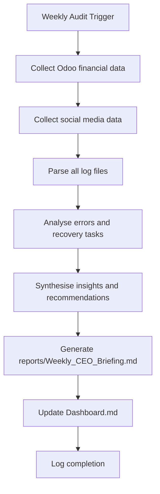

# Weekly Business Audit Skill

**Skill ID:** SKILL-020
**Status:** Active
**Created:** 2026-03-09
**Last Updated:** 2026-03-09
**Tier:** Gold

---

## Purpose

The Weekly Business Audit analyses all system activity across the past 7 days — financial data from Odoo, social media performance, operational metrics, and error patterns — then generates a CEO-level briefing saved to `reports/Weekly_CEO_Briefing.md`.

---

## Trigger

Run weekly (typically Monday morning) via:
- Windows Task Scheduler scheduled task
- Manual trigger: "Run weekly audit" or "Generate CEO briefing"
- Automatic: Ralph loop detecting a weekly audit task in inbox

---

## Workflow



---

## Step-by-Step Instructions

### Step 1 — Collect Financial Data
Call `mcp__odoo-accounting__get_financial_summary`.

Capture:
- `revenue_this_month`
- `open_invoices` count
- `overdue_invoices` count
- `draft_invoices` count
- `paid_this_month` count

If Odoo unavailable: note "Odoo offline — financial data unavailable" in report.

### Step 2 — Collect Social Media Data
Call `mcp__meta-social__get_social_summary`.

Parse log files for additional data:
- `logs/linkedin_post.log` — LinkedIn post count, errors
- `logs/twitter_activity.log` — Tweet count, errors
- `logs/meta_social.log` — Facebook/Instagram counts

Calculate:
- Total posts this week per platform
- Live vs. simulated ratio
- Any publishing errors

### Step 3 — Parse Operational Logs

Read `logs/ralph_loop.log` (last 7 days):
- Total tasks processed
- Tasks completed vs escalated
- Average processing cycle

Read `logs/error_log.md`:
- Group errors by component (ODOO, META, TWITTER, EMAIL, RALPH)
- Identify top error type
- Count recovery tasks created

Read `logs/email_sender_mcp.log`:
- Emails sent this week
- Emails in dry-run
- Approval requests created

### Step 4 — Synthesise Insights

Apply business intelligence rules:

| Condition | Recommendation |
|-----------|---------------|
| `overdue_invoices > 0` | Send follow-up emails for overdue accounts |
| `error_rate > 15%` | Investigate system stability, review error_log.md |
| `social_posts_week < 5` | Increase content frequency, delegate to Marketing_Agent |
| `revenue_mtd < target` | Review pipeline, activate Sales_Agent |
| `tasks_escalated > tasks_done` | Review Ralph loop classification logic |

### Step 5 — Generate CEO Briefing

Save to `reports/Weekly_CEO_Briefing.md`:

```markdown
# Weekly CEO Briefing

**Period:** YYYY-MM-DD to YYYY-MM-DD
**Generated:** YYYY-MM-DD HH:MM
**Prepared by:** AI Employee — SKILL-020

---

## Revenue Summary
[Odoo financial data table]

## Marketing Activity
[Social media post table by platform]

## Operational Insights
[Task pipeline stats, error rate]

## Error Report
[Grouped errors, top issues]

## Recommendations
[Numbered action items]
```

### Step 6 — Update Dashboard
Add audit completion entry to `Dashboard.md`:
```
| [TIMESTAMP] | Weekly Audit complete | reports/Weekly_CEO_Briefing.md generated |
```

---

## Full Report Template

```markdown
# Weekly CEO Briefing

**Period:** {week_start} to {week_end}
**Generated:** {timestamp}
**Prepared by:** AI Employee Gold Tier — Weekly Business Audit (SKILL-020)

---

## Revenue Summary

| Metric | Value |
|--------|-------|
| Revenue This Month (MTD) | ${revenue_mtd} |
| Invoices Paid This Month | {paid_count} |
| Open Invoices | {open_count} |
| Overdue Invoices | {overdue_count} |
| Draft Invoices | {draft_count} |

**Status:** {revenue_status}

---

## Marketing Activity

| Platform | Posts This Week | Live | Simulated | Errors |
|----------|----------------|------|-----------|--------|
| LinkedIn | {li_count} | {li_live} | {li_sim} | {li_err} |
| Twitter/X | {tw_count} | {tw_live} | {tw_sim} | {tw_err} |
| Facebook | {fb_count} | {fb_live} | {fb_sim} | {fb_err} |
| Instagram | {ig_count} | {ig_live} | {ig_sim} | {ig_err} |

**Total Posts:** {total_posts} | **Live:** {total_live} | **Simulated:** {total_sim}

---

## Operational Insights

| Metric | Value |
|--------|-------|
| Tasks Processed | {tasks_processed} |
| Tasks Completed | {tasks_done} |
| Tasks Escalated | {tasks_escalated} |
| Emails Sent | {emails_sent} |
| Approval Requests | {approvals_created} |
| Recovery Tasks Created | {recovery_count} |

---

## Error Report

| Component | Error Count | Top Error |
|-----------|-------------|-----------|
| Odoo | {odoo_errors} | {odoo_top_err} |
| Meta Social | {meta_errors} | {meta_top_err} |
| Twitter | {tw_errors} | {tw_top_err} |
| Email Sender | {email_errors} | {email_top_err} |
| Ralph Loop | {ralph_errors} | {ralph_top_err} |

---

## Recommendations

{numbered_recommendations}

---

*Generated automatically by AI Employee Gold Tier*
*Review and action items due by end of week*
```

---

## Logging

```
logs/weekly_audit.log
```

Format:
```
[YYYY-MM-DD HH:MM:SS] [WEEKLY_AUDIT] [STARTED] - Week audit for week of 2026-03-09
[YYYY-MM-DD HH:MM:SS] [WEEKLY_AUDIT] [DATA_COLLECTED] - Odoo: OK | Social: OK | Logs: OK
[YYYY-MM-DD HH:MM:SS] [WEEKLY_AUDIT] [REPORT_SAVED] - reports/Weekly_CEO_Briefing.md
[YYYY-MM-DD HH:MM:SS] [WEEKLY_AUDIT] [COMPLETE] - Duration: 12s
```

---

## Error Handling

| Scenario | Action |
|----------|--------|
| Odoo offline | Note in report, continue with other data |
| Log file missing | Note absence, continue |
| Report save fails | Retry with timestamp suffix, log error |
| All data unavailable | Write minimal report noting system issues |

---

## Integration Points

### Calls:
- `mcp__odoo-accounting__get_financial_summary`
- `mcp__meta-social__get_social_summary`

### Reads:
- `logs/ralph_loop.log`
- `logs/error_log.md`
- `logs/email_sender_mcp.log`
- `logs/linkedin_post.log`
- `logs/twitter_activity.log`
- `logs/meta_social.log`
- `logs/marketing_activity.log`

### Writes:
- `reports/Weekly_CEO_Briefing.md`
- `logs/weekly_audit.log`
- `Dashboard.md` — completion entry

### Related Skills:
- [[skills/Business_Intelligence]] — SKILL-014 (data collection methods)
- [[skills/Weekly_CEO_Briefing]] — SKILL-005 (legacy briefing skill)
- [[skills/Reporting]] — SKILL-004

---

## Version History

| Version | Date | Changes |
|---------|------|---------|
| 1.0 | 2026-03-09 | Initial Gold Tier creation |

---

*This skill is managed by AI Employee v2.0 — Gold Tier*
*Every week reviewed. Every rupee counted. Every post tracked.*
