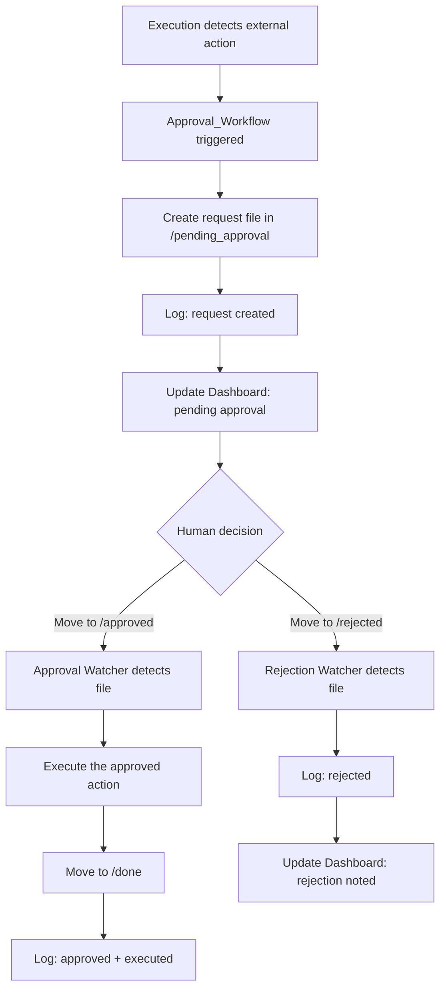

# Approval Workflow Skill

**Skill ID:** SKILL-008
**Status:** Active
**Created:** 2026-02-26
**Last Updated:** 2026-02-26

---

## Purpose

Gate all external-facing actions behind a human approval step. Whenever the agent would send an email, post content, or contact an external party, the action is **NOT executed immediately**. Instead, a request file is created in `/pending_approval` and the action is only carried out after a human moves the file to `/approved`.

---

## Core Rule

```
IF action involves:
    - Sending email
    - Posting content (social media, blog, website)
    - Contacting an external party (client, vendor, API call with side-effects)
THEN:
    - DO NOT execute immediately
    - Create approval request in /pending_approval
    - WAIT for human decision
```

---

## Position in Pipeline

```
Execution → Approval_Workflow → /pending_approval
                                      ↓
                          Human reviews request
                         ↙                    ↘
                  /approved                /rejected
                      ↓                        ↓
              Execute action              Log rejection
                      ↓
                   /done
```

This skill acts as a **gate** inside the Execution skill. When Execution detects an external action, it delegates to Approval_Workflow instead of acting directly.

---

## Workflow



---

## Procedure

### Step 1: Detect External Action

The Execution skill (SKILL-003) checks every action before running it:

| Action Type | Trigger Keywords |
|-------------|-----------------|
| Send Email | send, reply, email, forward, respond |
| Post Content | post, publish, tweet, share, upload |
| Contact External | call, notify, contact, message, reach out, invoice |

If any of these are detected, execution **stops** and delegates to this skill.

### Step 2: Create Approval Request File

**Location:** `/pending_approval`

**Filename Convention:** `approval_<date>_<action_type>_<short_description>.md`
- All lowercase
- Spaces replaced with underscores
- Date format: `YYYY-MM-DD`
- Example: `approval_2026-02-26_send_email_client_proposal.md`

**Template:**

```markdown
# Approval Request

**Request ID:** {auto_generated}
**Created:** {YYYY-MM-DD HH:MM}
**Status:** PENDING
**Source Skill:** {originating skill}

---

## Action Type

{send_email | post_content | contact_external}

---

## Action Details

| Field | Value |
|-------|-------|
| **Type** | {action type} |
| **Target** | {recipient / platform / party} |
| **Subject** | {subject or title} |
| **Source Task** | {originating task file} |

---

## Content Preview

{Full content that would be sent / posted / communicated}

---

## Context

{Why this action is being taken, which task triggered it}

---

## Risk Assessment

| Factor | Level |
|--------|-------|
| **External Visibility** | {High/Medium/Low} |
| **Reversibility** | {Easy/Difficult/Impossible} |
| **Impact** | {description} |

---

## Instructions

- **To approve:** Move this file to `/approved`
- **To reject:** Move this file to `/rejected`

---

*Generated by Approval_Workflow (SKILL-008)*
*DO NOT execute without approval*
```

### Step 3: Log Request Creation

- Log to `/logs/approval_workflow.log`
- Format: `[YYYY-MM-DD HH:MM:SS] [APPROVAL_WORKFLOW] [REQUEST_CREATED] - {filename}`

### Step 4: Update Dashboard

- Increment pending approval count
- Add alert in Alerts & Blockers section

### Step 5: Watch for Human Decision

The `approval_watcher.py` script monitors three folders:

| Folder | Meaning | Action |
|--------|---------|--------|
| `/pending_approval` | Awaiting decision | No action, display in Dashboard |
| `/approved` | Human approved | Execute the action, move to `/done` |
| `/rejected` | Human rejected | Log rejection, archive file |

### Step 6: Execute Approved Action

When a file appears in `/approved`:
1. Read the approval request file
2. Parse the action type and details
3. Execute the action (send email, post content, etc.)
4. Move the file to `/done` with `_approved` suffix
5. Log: `[APPROVED] [EXECUTED] - {action description}`

### Step 7: Handle Rejection

When a file appears in `/rejected`:
1. Read the rejection file
2. Log: `[REJECTED] - {action description}`
3. Update Dashboard: remove from pending count
4. File stays in `/rejected` as audit trail

---

## Folder Structure

```
/pending_approval    ← Requests awaiting human decision
/approved            ← Human-approved actions (watcher picks up here)
/rejected            ← Human-rejected actions (archived)
```

---

## Action Execution Details

### Send Email

When an approved action is type `send_email`:
1. Parse recipient, subject, and body from the request file
2. Connect to Gmail SMTP using credentials from `.env`
3. Send the email
4. Log delivery confirmation

### Post Content

When an approved action is type `post_content`:
1. Parse platform, content, and metadata
2. Execute via appropriate API or create ready-to-post file
3. Log posting confirmation

### Contact External

When an approved action is type `contact_external`:
1. Parse contact details and message
2. Execute via appropriate channel
3. Log communication record

---

## Logging Requirements

Every action must log:

```
[YYYY-MM-DD HH:MM:SS] [APPROVAL_WORKFLOW] [ACTION] - [DETAILS]
```

**Required Log Entries:**
1. Request created: `[REQUEST_CREATED] File: {filename}, Type: {action_type}`
2. Pending notification: `[PENDING] Awaiting human decision: {filename}`
3. Approval detected: `[APPROVED] File: {filename}`
4. Action executed: `[EXECUTED] Type: {action_type}, Target: {target}`
5. Rejection detected: `[REJECTED] File: {filename}, Reason: {if provided}`
6. Error: `[ERROR] {description}`

---

## Error Handling

| Scenario | Action |
|----------|--------|
| Action execution fails after approval | Log error, keep in `/approved`, retry once |
| File format invalid | Log warning, move to `/rejected` with parse error note |
| Duplicate request detected | Skip creation, log warning |
| Watcher loses connection | Auto-restart, log reconnection |

---

## Integration Points

### Input From:
- [[skills/Execution]] - Delegates external actions here
- [[skills/Gmail_Watcher]] - Email-derived tasks may trigger approvals

### Output To:
- `/pending_approval` - Request files
- `/approved` - After human approval
- `/rejected` - After human rejection
- `/done` - After execution
- `/logs/approval_workflow.log` - Dedicated log
- `Dashboard.md` - Status updates

### Modifies:
- [[skills/Execution]] - Must check with Approval_Workflow before external actions

---

## Security Notes

- No external action is ever taken without a file existing in `/approved`
- The human must physically move the file (drag in Obsidian or file manager)
- All decisions are logged with timestamps for full audit trail
- Rejected actions are preserved for review, never deleted
- SMTP credentials reuse the same `.env` as Gmail Watcher

---

## Example Execution

**Trigger:** Execution skill wants to send a client proposal email

**Step 1:** Creates `/pending_approval/approval_2026-02-26_send_email_client_proposal.md`

```markdown
# Approval Request

**Request ID:** APR-20260226-001
**Created:** 2026-02-26 14:30
**Status:** PENDING
**Source Skill:** Execution (SKILL-003)

---

## Action Type

send_email

---

## Action Details

| Field | Value |
|-------|-------|
| **Type** | Send Email |
| **Target** | jane@clientco.com |
| **Subject** | Q1 Project Proposal |
| **Source Task** | client_proposal_task.md |

---

## Content Preview

Dear Jane,

Please find attached our Q1 project proposal for the dashboard
redesign project. Key highlights include...

---

## Context

Task originated from inbox email requesting proposal. Plan was
created and approved. This is the final delivery step.

---

## Risk Assessment

| Factor | Level |
|--------|-------|
| **External Visibility** | High |
| **Reversibility** | Impossible (email cannot be unsent) |
| **Impact** | Client relationship, revenue |

---

## Instructions

- **To approve:** Move this file to `/approved`
- **To reject:** Move this file to `/rejected`

---

*Generated by Approval_Workflow (SKILL-008)*
*DO NOT execute without approval*
```

**Step 2:** Human reviews in Obsidian, drags file to `/approved`

**Step 3:** Watcher detects file, sends the email, moves to `/done`

---

## Related Skills

- [[skills/Execution]] - Primary caller of this skill
- [[skills/Gmail_Watcher]] - Shares SMTP credentials for sending
- [[skills/Reporting]] - Logs all approval decisions
- [[skills/reasoning_planner]] - Plans may identify approval-required steps

---

## Version History

| Version | Date | Changes |
|---------|------|---------|
| 1.0 | 2026-02-26 | Initial skill creation |

---

*This skill is managed by AI Employee v1.1*
*No external action without human approval - safety first*
