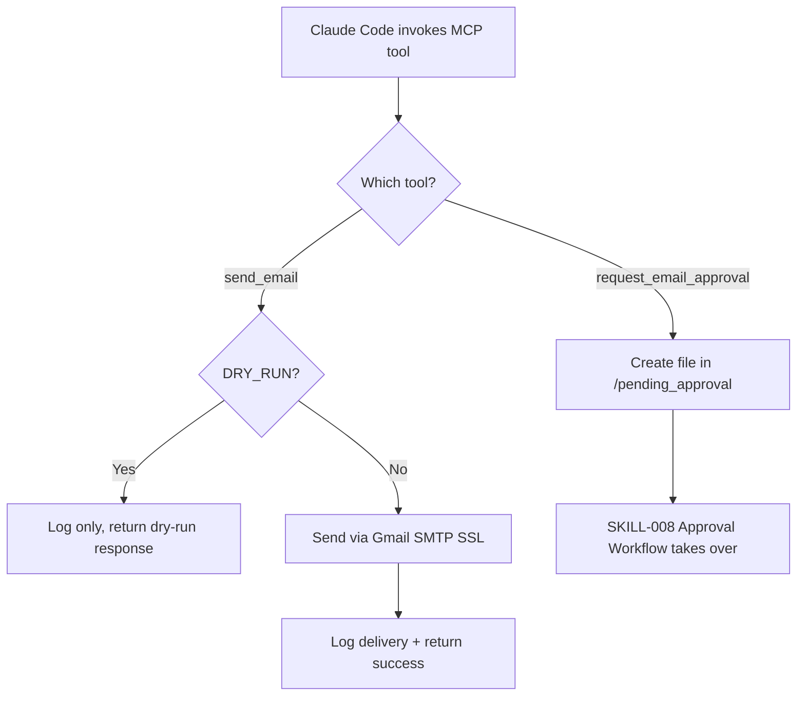

# Email Sender MCP Skill

**Skill ID:** SKILL-009
**Status:** Active
**Created:** 2026-02-26
**Last Updated:** 2026-02-26

---

## Purpose

Expose email-sending capabilities as native Claude Code tools via an MCP (Model Context Protocol) server. This gives Claude two options for outbound email: **direct send** (with optional dry-run safety) and **approval-gated send** (integrating with SKILL-008).

---

## Position in Pipeline

```
Claude Code ──→ MCP tool call ──→ Email_Sender_MCP
                                       │
                          ┌─────────────┴──────────────┐
                          │                            │
                    send_email               request_email_approval
                          │                            │
                   Gmail SMTP                /pending_approval
                  (or dry-run)                     ↓
                                           Human decision
                                          ↙            ↘
                                   /approved        /rejected
                                      ↓
                               Execute → /done
```

This skill operates as a **tool layer** that Claude Code can call directly during any conversation, independent of the file-based pipeline.

---

## Workflow



---

## Tools Exposed

### 1. `send_email`

| Parameter | Type | Required | Description |
|-----------|------|----------|-------------|
| `recipient` | string | Yes | Email address to send to |
| `subject` | string | Yes | Email subject line |
| `body` | string | Yes | Plain-text email body |

**Behaviour:**
- Validates email format, required fields
- If `EMAIL_DRY_RUN=true`: logs and returns dry-run response (no SMTP)
- Otherwise: sends via Gmail SMTP SSL (port 465)
- Returns `{"success": true/false, "message": "..."}`

### 2. `request_email_approval`

| Parameter | Type | Required | Description |
|-----------|------|----------|-------------|
| `recipient` | string | Yes | Email address the email would go to |
| `subject` | string | Yes | Email subject line |
| `body` | string | Yes | Plain-text email body |
| `context` | string | No | Why this email should be sent |

**Behaviour:**
- Creates approval request file in `/pending_approval` (SKILL-008 format)
- Does NOT send the email
- Returns `{"success": true, "approval_file": "...", "status": "pending_approval"}`

---

## Configuration

### Required Environment Variables (`.env`)

```
GMAIL_ADDRESS=your.email@gmail.com
GMAIL_APP_PASSWORD=xxxx-xxxx-xxxx-xxxx
EMAIL_DRY_RUN=false
```

- `EMAIL_DRY_RUN=true` prevents any real email from being sent (safe for testing)
- SMTP credentials are shared with Gmail_Watcher (SKILL-007) and Approval_Workflow (SKILL-008)

### MCP Configuration (`.mcp.json`)

```json
{
  "mcpServers": {
    "email-sender": {
      "command": "python",
      "args": ["mcp_servers/email_sender.py"],
      "env": {}
    }
  }
}
```

---

## Running the Server

The MCP server runs automatically when Claude Code starts (configured via `.mcp.json`). To test manually:

```bash
# Install dependency
pip install mcp

# Test startup (will wait for stdio input)
python mcp_servers/email_sender.py
```

---

## Logging

All actions log to `/logs/email_sender_mcp.log`:

```
[YYYY-MM-DD HH:MM:SS] [EMAIL_SENDER_MCP] [ACTION] - details
```

**Log Actions:**
- `SENT` - Email successfully sent
- `DRY_RUN` - Email logged but not sent (dry-run mode)
- `APPROVAL_CREATED` - Approval request file created
- `VALIDATION_ERROR` - Invalid input rejected
- `ERROR` - SMTP or other failure

---

## Error Handling

| Scenario | Action |
|----------|--------|
| Invalid email format | Return error, log validation failure |
| Missing required field | Return error with field name |
| SMTP credentials missing | Return error, do not attempt connection |
| SMTP connection failure | Return error with exception details |
| Dry-run mode active | Log and return success with `dry_run: true` |
| Approval file collision | Auto-increment filename suffix |

---

## Integration Points

### Uses:
- `.env` - SMTP credentials (shared with SKILL-007, SKILL-008)
- `/pending_approval` - Approval request output (SKILL-008 format)

### Used By:
- Claude Code - Via MCP tool calls in any conversation
- [[skills/approval_workflow]] - Processes approval request files

### Related:
- [[skills/Gmail_Watcher]] - Shares Gmail credentials
- [[skills/approval_workflow]] - Approval request format compatibility
- [[skills/Execution]] - Alternative to file-based email sending

---

## Security Notes

- `EMAIL_DRY_RUN=true` provides a safe testing mode (no emails leave the system)
- `request_email_approval` always requires human approval before any email is sent
- Credentials loaded from `.env` (excluded from git via `.gitignore`)
- SMTP uses SSL/TLS (port 465) for encrypted transmission
- Email format validation prevents malformed addresses

---

## Example Usage

### Direct send (dry-run)
```
Tool: send_email
  recipient: "test@example.com"
  subject: "Test Email"
  body: "This is a test."

Response: {"success": true, "message": "DRY RUN - email not sent", "dry_run": true}
```

### Approval-gated send
```
Tool: request_email_approval
  recipient: "client@company.com"
  subject: "Project Update"
  body: "Hi, here is the latest update..."
  context: "Client requested weekly status update"

Response: {"success": true, "approval_file": "...", "status": "pending_approval"}
```

---

## Related Skills

- [[skills/Gmail_Watcher]] - Inbound email monitoring
- [[skills/approval_workflow]] - Human approval gate
- [[skills/Execution]] - Task execution engine
- [[skills/Reporting]] - Logs activities from this skill

---

## Version History

| Version | Date | Changes |
|---------|------|---------|
| 1.0 | 2026-02-26 | Initial skill creation |

---

*This skill is managed by AI Employee v1.1*
*Send with confidence - or send with approval*
