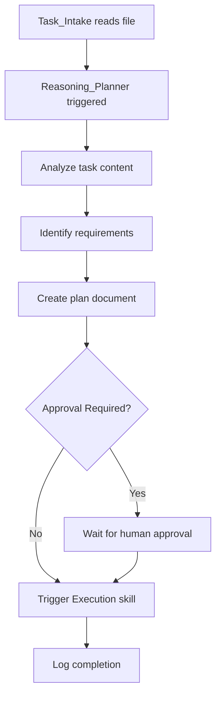

# Reasoning Planner Skill

**Skill ID:** SKILL-006
**Status:** Active
**Created:** 2026-01-25
**Last Updated:** 2026-01-25

---

## Purpose

Before executing any task from `/inbox`, create a structured reasoning plan that analyzes the task, identifies requirements, and outlines execution steps. This ensures thoughtful, documented decision-making before action.

---

## Position in Pipeline

```
/inbox → Task_Intake → REASONING_PLANNER → Execution → /done
                              ↓
                     /plans/{task_name}_plan.md
```

This skill is triggered AFTER Task_Intake reads the file and BEFORE Execution begins.

---

## Workflow



---

## Procedure

### Step 1: Receive Task from Task_Intake
- [ ] Accept task file from `/needs_action`
- [ ] Read full task content
- [ ] Extract task name for plan filename

### Step 2: Analyze Task
- [ ] Identify the core objective
- [ ] Determine what information is needed
- [ ] Break down into executable steps
- [ ] Identify risks and dependencies
- [ ] Assess if human approval is required

### Step 3: Create Plan Document

**Location:** `/plans/{task_name}_plan.md`

**Filename Convention:** All lowercase, underscores for spaces
- Example: `linkedin_content_plan.md` → `linkedin_content_plan_plan.md`
- Example: `client_proposal.md` → `client_proposal_plan.md`

### Step 4: Write Plan Using Template

```markdown
# Plan: {Task Name}

**Created:** YYYY-MM-DD
**Source Task:** {original filename}
**Status:** Draft | Approved | In Progress | Complete

---

## Objective

[Clear, concise statement of what needs to be accomplished]

---

## Required Information

| Item | Source | Status |
|------|--------|--------|
| [What info needed] | [Where to get it] | [Available/Missing] |

---

## Steps to Execute

- [ ] Step 1: [Action]
  - Details: [specifics]
  - Output: [expected result]

- [ ] Step 2: [Action]
  - Details: [specifics]
  - Output: [expected result]

[Continue as needed...]

---

## Risks / Dependencies

| Risk | Impact | Mitigation |
|------|--------|------------|
| [Potential issue] | [High/Medium/Low] | [How to handle] |

### Dependencies
- [ ] Dependency 1: [description]
- [ ] Dependency 2: [description]

---

## Approval Required?

**Decision:** Yes / No

**Reason:** [Why approval is or isn't needed]

**If Yes:**
- Waiting for: [Human/Manager]
- Approval criteria: [What needs to be confirmed]

---

## Execution Trigger

Upon plan completion/approval, trigger: [[skills/Execution]]

---

*Plan generated by Reasoning_Planner (SKILL-006)*
```

### Step 5: Log Plan Creation
- [ ] Log to `/logs/Skill_Usage_Log.md`
- [ ] Record: timestamp, task name, plan filename

### Step 6: Update Dashboard
- [ ] Set status: "Planning Complete"
- [ ] Show plan location
- [ ] Indicate next step

### Step 7: Trigger Execution (if no approval needed)
- [ ] If `Approval Required = No`: Immediately trigger Execution skill
- [ ] If `Approval Required = Yes`: Wait for human confirmation file

---

## Approval Criteria

**Automatic Approval (No human needed):**
- Content creation tasks
- Documentation updates
- Internal file operations
- Reporting tasks

**Human Approval Required:**
- External communications
- Financial decisions
- Client deliverables
- System configuration changes
- Anything with `#approval` tag in task

---

## Integration Points

### Input From:
- [[skills/Task_Intake]] - Receives processed task files

### Output To:
- `/plans/` folder - Plan documents
- [[skills/Execution]] - Triggers after planning
- [[skills/Reporting]] - Logs all activities

---

## Logging Requirements

Every plan creation must log:

```
[YYYY-MM-DD HH:MM] [REASONING_PLANNER] [ACTION] - [DETAILS]
```

**Required Log Entries:**
1. Plan started: `[PLAN_START] Task: {name}`
2. Analysis complete: `[ANALYSIS] Requirements identified`
3. Plan written: `[PLAN_CREATED] File: {filename}`
4. Approval status: `[APPROVAL] Required: Yes/No`
5. Execution triggered: `[TRIGGER] Execution skill called`

---

## Error Handling

| Scenario | Action |
|----------|--------|
| Task unclear | Create plan with assumptions, mark for review |
| Missing info | List in "Required Information" as missing |
| Cannot plan | Create blocker note, request human input |

---

## Example Execution

**Input Task:** `create_marketing_report.md`

**Generated Plan:** `/plans/create_marketing_report_plan.md`

```markdown
# Plan: Create Marketing Report

**Created:** 2026-01-25
**Source Task:** create_marketing_report.md
**Status:** Approved

---

## Objective

Generate a comprehensive marketing performance report for Q1 2026.

---

## Required Information

| Item | Source | Status |
|------|--------|--------|
| Sales figures | /clients/data | Available |
| Campaign metrics | Marketing team | Missing |
| Budget data | Finance folder | Available |

---

## Steps to Execute

- [ ] Step 1: Gather Q1 sales data
  - Details: Pull from /clients/data folder
  - Output: Raw data compiled

- [ ] Step 2: Request campaign metrics
  - Details: Create request file for marketing team
  - Output: Metrics received

- [ ] Step 3: Compile report
  - Details: Use standard report template
  - Output: Draft report

- [ ] Step 4: Review and finalize
  - Details: Check accuracy, format
  - Output: Final report.md

---

## Risks / Dependencies

| Risk | Impact | Mitigation |
|------|--------|------------|
| Missing campaign data | Medium | Use available data, note gaps |
| Deadline pressure | Low | Prioritize key metrics |

---

## Approval Required?

**Decision:** No

**Reason:** Internal report, no external communication

---

## Execution Trigger

Triggering: [[skills/Execution]]
```

---

## Related Skills

- [[skills/Task_Intake]] - Precedes this skill
- [[skills/Execution]] - Follows this skill
- [[skills/Reporting]] - Logs activities
- [[skills/Planning]] - Legacy planning (superseded for complex tasks)

---

## Version History

| Version | Date | Changes |
|---------|------|---------|
| 1.0 | 2026-01-25 | Initial skill creation |

---

*This skill is managed by AI Employee v1.0*
*Reasoning before action ensures quality outcomes*
